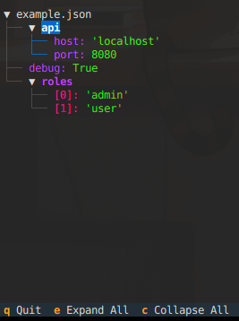

## TREEJSON
### Traverse a JSON using a collapsible Tree 

---

## Install 
`pip install -e .`

## Usage:
`treejson <json_file_or_json_string>`

### With file:
`treejson example.json`

### With string:
`treejson '{"test": {"test2": "test3"}}'`
